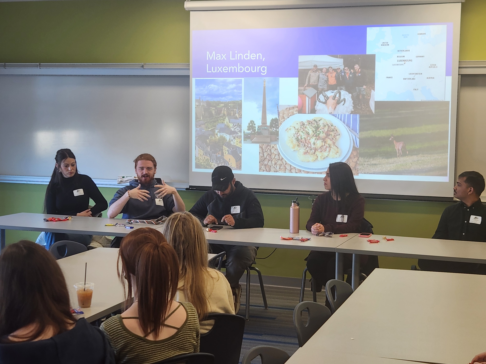

---
title: International Student Panel at Gallatin High School

event: International Student Panel at Gallatin High School
event_url: https://ghs.bsd7.org/

location: Gallatin High School Library
address:
  street: 4455 Annie Street
  city: Bozeman
  region: MT
  postcode: 
  country: United States

summary: The International Networking Initiative, in partnership with MSU Office of International Programs organized this International Student Panel at Gallatin High School.
abstract: 'This event, hosted by the International Networking Initiative and MSU Office of International Programs, took place in Gallatin High School. The attendees were student members of the Culture Appreciation Club. They advisor, Kerri Cobb, describes the club as a "student-centered club where we come together to celebrate world cultures. At our club meetings, we will be planning and organizing educational and cultural activities within the Raptor student-body, listening to various cultural speakers, and connecting with students in schools across the globe." We all learned from each other.'

# Talk start and end times.
#   End time can optionally be hidden by prefixing the line with `#`.
date: '2025-04-25'
#date_end: '2030-06-01T15:00:00Z'
all_day: true

# Schedule page publish date (NOT talk date).
publishDate: '2024-05-08T00:00:00Z'

authors:
  - admin

tags: []

# Is this a featured talk? (true/false)
featured: false

image:
  caption: 'Autosubmitted photography'
  focal_point: Right

#links:
#  - icon: twitter
#    icon_pack: fab
#    name: Follow
#    url: https://twitter.com/georgecushen
# url_code: 'https://github.com'
# url_pdf: ''
# url_slides: 'https://slideshare.net'
# url_video: 'https://youtube.com'

# Markdown Slides (optional).
#   Associate this talk with Markdown slides.
#   Simply enter your slide deck's filename without extension.
#   E.g. `slides = "example-slides"` references `content/slides/example-slides.md`.
#   Otherwise, set `slides = ""`.
slides: ""

# Projects (optional).
#   Associate this post with one or more of your projects.
#   Simply enter your project's folder or file name without extension.
#   E.g. `projects = ["internal-project"]` references `content/project/deep-learning/index.md`.
#   Otherwise, set `projects = []`.
projects:
  - []

-------

  

  <figure style="text-align: center;">
    
    <figcaption>Panelist from left to right: Maddison Whitaker-Barnett (New Zeland), Max Linden (Luxembourg), Shoaib Khan (Pakistan), Flor Vega Castillo (Peru), and Aishik Biswas (India). </figcaption>
  </figure>
  

