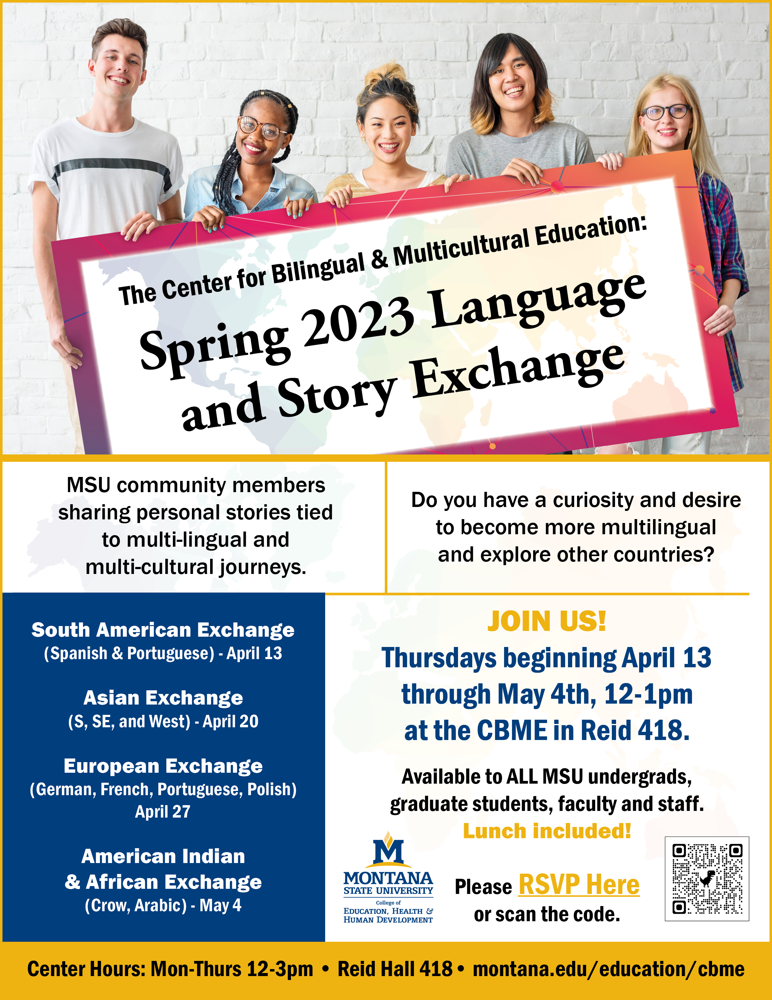

---
title: Spring 2023 Language and Story Exchanges

event: Spring 2023 Language and Story Exchanges
event_url: https://www.montana.edu/calendar/events/45966

location: Reid Hall, 418
address:
  street: MSU campus
  city: 
  region: MT
  postcode: 
  country: United States

summary: The Center for Bilingual & Multicultural Education invited the MSU community to join us for lunch and learn about the multilingual and multicultural journeys of MSU faculty, staff and students.
abstract: 'According to the organizers, the goal for these exchanges is to demonstrate, celebrate and explore the multicultural diversity that exists in our MSU campus community and create dialogue and inquiry around concepts tied to multilingualism, multiculturalism, and what it is like to be on a journey to belong.'

# Talk start and end times.
#   End time can optionally be hidden by prefixing the line with `#`.
date: '2023-04-08'
#date_end: '2030-06-01T15:00:00Z'
all_day: false

# Schedule page publish date (NOT talk date).
publishDate: '2024-05-08T00:00:00Z'

authors:
  - admin

tags: []

# Is this a featured talk? (true/false)
featured: false

image:
  caption: 'Autosubmitted photography'
  focal_point: Right

#links:
#  - icon: twitter
#    icon_pack: fab
#    name: Follow
#    url: https://twitter.com/georgecushen
# url_code: 'https://github.com'
# url_pdf: ''
# url_slides: 'https://slideshare.net'
# url_video: 'https://youtube.com'

# Markdown Slides (optional).
#   Associate this talk with Markdown slides.
#   Simply enter your slide deck's filename without extension.
#   E.g. `slides = "example-slides"` references `content/slides/example-slides.md`.
#   Otherwise, set `slides = ""`.
slides: ""

# Projects (optional).
#   Associate this post with one or more of your projects.
#   Simply enter your project's folder or file name without extension.
#   E.g. `projects = ["internal-project"]` references `content/project/deep-learning/index.md`.
#   Otherwise, set `projects = []`.
projects:
  - []

-------
  

  <figure style="text-align: center;">
    
    <figcaption>Official flyer of these event series.  </figcaption>
  </figure>
  

  

  <figure style="text-align: center;">
    
    <figcaption>Participating as a panelist during the first session of this multicultural event (South American Exchange). </figcaption>
  </figure>
  

