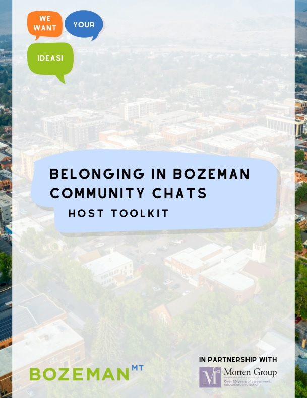

One way to learn beyond the classroom is to have hands-on experiences with the overall community, with programs and projects led and carried on by government institutions, non-profits, and organized groups of citizens. A big thanks to Dani Hess, City of Bozeman Community Engagement Coordinator, for the trust and this fabulous opportunity to get closer to Bozeman, to its constituencies, and to everybody who makes this city going forward.

The MSU Exponent shared [an article about the City of Bozeman's Community Chats](https://www.msuexponent.com/news/make-your-voice-heard-with-a-bozeman-community-chat/article_b1ef2ec6-4db3-11ee-879e-73dfca11e1e8.html), and they invited me to share my experience hosting one of these. See the attached for the full article in which Dani highlighted the goals of this initiative as part of a bigger plan.

  <figure style="text-align: center;">
    
    <figcaption>First page of the Community Chat toolkit for volunteers</figcaption>
  </figure>

An extract from the article:
"One chat that has already happened was hosted by Flor Vega-Castillo, a graduate student from Peru who is currently in her second year in the master of public administration program and a member of the First-Generation Students Association. Vega-Castillo, who hosted the chat entirely in Spanish said, 'the goal was to give them [participants] a voice because sometimes due to work, or any other realms of life they don’t have this chance to talk and share their experiences.' Her chat was centered around the topics of: housing, mental health and education. Vega-Castillo pointed to how these three issues, while complex in their ways, can overlap in the community. 'Another barrier — like when the school district for instance, or any other organization — wants to bring a specialist on a topic, maybe a multi-lingual representative for the organization, sometimes housing is a challenge for this person to accept the job. It becomes a wicked problem because everything is so connected,' she said."

  <figure style="text-align: center;">
    
    <figcaption>City of Bozeman logo.</figcaption>
  </figure>

More information about the Belonging in Bozeman plan can be found in their [Communications and Engagement website](https://www.bozeman.net/departments/administration/communications-engagement).

