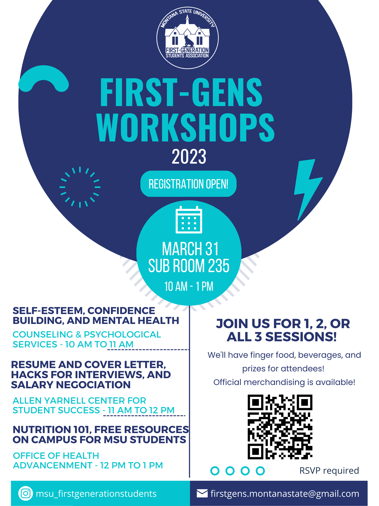

Soon after starting my master's in public administration program at MSU, I got involved with different on campus initiatives. One of them led me to co-found a student group that would increase opportunities for those students (undegraduate and graduate) with less familiarity with higher education. Thus, by January 2023 the [First-Generation Students Association](https://www.instagram.com/msu_firstgenerationstudents/) was a registered student organization. We started our activities thanks to the support of the Office of Diversity and Inclusion, the Office of Student Engagement, and the Graduate School since November 2022, but it was until the start of the Spring semester that we became official.

The first article that [the MSU Exponent Newspaper](https://www.msuexponent.com/) published was about the creation of the student organization. Amanda Fulton interviewed me to learn more about our mission and the club creation. I also mentioned my overall goal was to help fellow first-generation college students to find that spark that will move them forward into their academic journey. You can access the article [New association emerges to support first-generation students
here](https://www.msuexponent.com/news/new-association-emerges-to-support-first-generation-students/article_fb052f02-b3a3-11ed-bdb3-db95a2a902cf.html) 

    

We were interviewed once again by the MSU The Exponent Newspaper to disseminate an open invite to every student to attend our series of workshops. In partnership with the Counseling and Psychological Services, the Allen Yarnell Center for Student Success and the Office of Health Advancement, we covered topics such as mental health, professional development and nutrition in an interative way.

Our attendees had a great opportunity to make connections, get to know the resources they can use on-campus and meet friendly faces from supportive staff. You can read the article [First-Gen Students Association plans mental health, nutrition and professional development workshops
 here](https://www.msuexponent.com/news/first-gen-students-association-plans-mental-health-nutrition-and-professional-development-workshops/article_71719118-c9a1-11ed-90d4-1f30634206d1.html)

    

