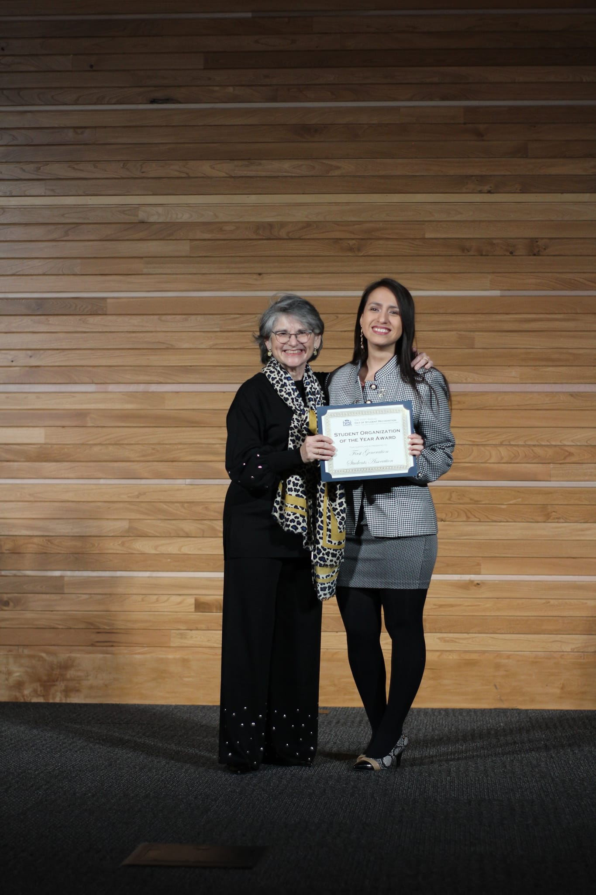
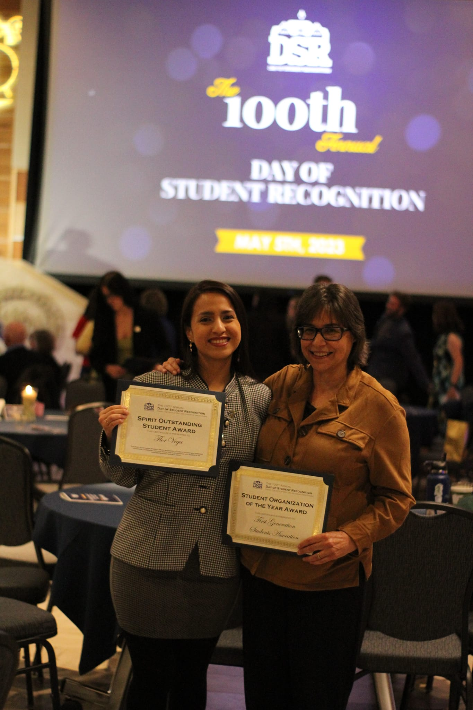

The First-Generation Students Association at MSU obtained the Student Organization of the Year Award during the 100th Annual Day of Student Recognition on May 5, 2023. Being the Founder President of this student group with members from diverse backgrouns represents a big commitment and honor. We serve undergraduate and graduate students.

According to the National Association of Student Personnel Administrators - [NASPA](https://firstgen.naspa.org/), a first-generation college student is someone whose parents did not complete a 4-year college or university degree.

FGSA mission statement is to provide a welcoming environment through planned and coordinated activities and programs to offer first-generation students positive and high-impact experiences and support. 

  <figure style="text-align: center;">
    
    <figcaption>An outreach activity during Catapalooza (an student engagement event) in August, 2023.</figcaption>
  </figure>

Thanks to the generosity of MSU offices, departments, and allies in the MSU community, we were able to host:
- Tabling events in student resource and student engagement fairs
- Professional development workshops with cross-departamental speakers
- Admissions webinars in partnership with the Admissions office
- The First-Gen week in partnership with MSU's offices
Among other initiatives.

  <figure style="text-align: center;">
    
    <figcaption>Dr. Barbara do Amaral, FGSA Club Advisor, and myself as FGSA representative after the ceremony.</figcaption>
  </figure>

