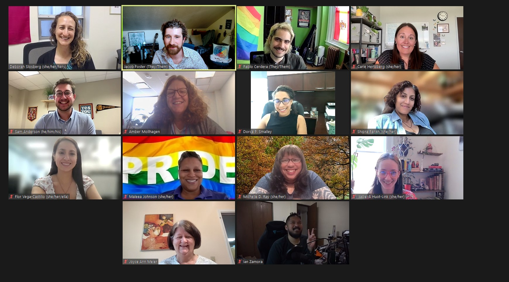

 I am pleased to announce that I received the President's Award for Gender Equity (Leadership category) during the 101th [Day of Student Recognition](https://www.montana.edu/engagement/programs/dsr/). 🌟 This award is designed to honor students who have worked to improve issues related to gender, equity, and diversity. This event awarded students and groups in five categories: Legacy, Service, Leadership, Teaching & Mentorship, and Academics & Research.  

 Besides my graduate studies in the master in public administration program and my work as a graduate recruitment and admissions assistant, I have led two student organizations: I served as president of the [First-Generation Students Association](https://www.instagram.com/msu_firstgenerationstudents/) and vice president of United Nations Association of the United States of America [UNA-USA Bozeman chapter](https://www.instagram.com/unausamontanastate/). However, my engagement went beyond my on-campus relationships and volunteered for different non-profit organizations.

 I served as a Promotora de Salud (community health worker) at [Proyecto Salud](https://www.montana.edu/nursing/salud/), an MSU-led team that works to provide healthcare services to Latino and Latina immigrants in Gallatin County. My role was to help Latina mothers with no English background, improve their mental health and well-being through behavioral activation techniques. Other volunteer roles include [Thrive’s Child Advancement Project](https://allthrive.org/programs/child-advancement-project/), where I served as a mentor for a Latina teenager during our weekly meetings at Hyalite High School. Furthermore, I have assisted the [World Language Initiative](https://www.wlimt.org/) with their Spanish classes as a way to facilitate language accessibility. 

 Finally, I want to highlight that I got selected to be a part of the first cohort of the [Moral Courage College](https://www.moralcourage.com/) program at MSU, Diversity without Division, taught by Irshad Manji. I also got invited to be one of the four MSU representatives who will participate in [the University of Michigan’s Intergroup Relations Program](https://igr.umich.edu/) in the summer. These invitations reflect that my consistent engagement with gender equity, diversity, and inclusion, as well as intergroup dialogue are seen.

  <figure style="text-align: center;">
    
    <figcaption>Receiving the award from Montana State University President, Waded Cruzado.</figcaption>
  </figure>

Experiences in leadership positions at two student organizations taught me:
- Some students might go directly asking for some type of help, others might need you to reach out and invite them to join your group.
- There is always someone willing to help, from individuals as volunteers to Deans sponsoring our events and activities.
- Empowered students will feel more confident in achieving academic success.
- Student-led initiatives is as key for those organizing an event or program as for those faculty, staff or community members attending those. It is an invaluable development opportunity for students and attendees can learn many lessons from them.

  <figure style="text-align: center;">
    
    <figcaption>FGSA founding officers. From left to right: Audrina Williams (Secretary), Flor Vega-Castillo (President) and Natalie De Marco (Vice President) during the Study Abroad and Involvement Fair in Spring 2023. </figcaption>
  </figure>

  <figure style="text-align: center;">
    
    <figcaption>UNA-USA officers. From left to right: Siddat Nesar (Treasurer), Flor Vega-Castillo (Vice President) and Giovanni Guillen (Communications) during our visit to the United Nations Headquarters in New York. </figcaption>
  </figure>

