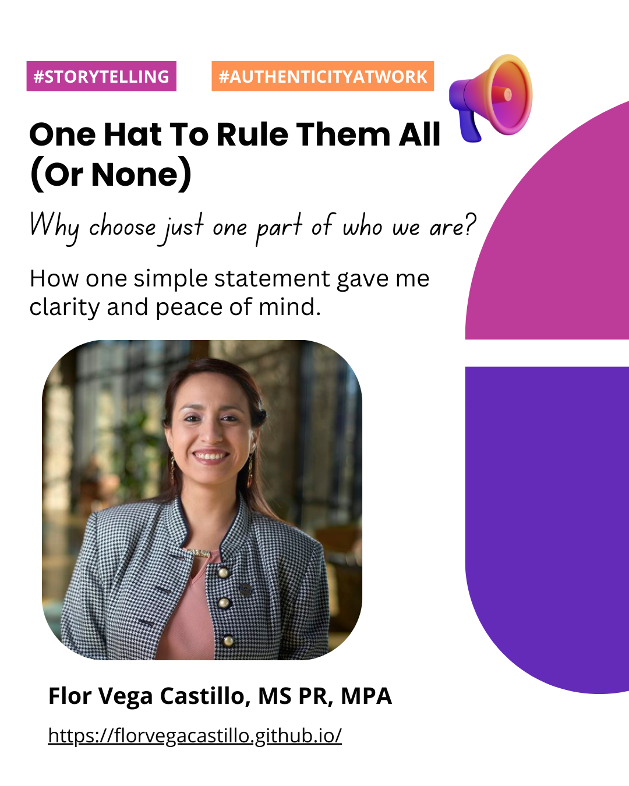

 📢 Based on my latest experience working with an amazing Admissions and Recruitment team, these are some essentials I learned:

 𝟭. 𝗠𝗮𝗸𝗲 𝗬𝗼𝘂𝗿𝘀𝗲𝗹𝗳 𝗠𝘂𝗹𝘁𝗶𝗽𝗿𝗲𝘀𝗲𝗻𝘁
 🤔Internalising the fact that Potential Applicants (PAs) have numerous reasons to consider earning a degree is a good start. Although some PAs consider the whole gathering information process to be clear and simple, others might need extra help to initiate the application process. One way to make what might look like a daunting action (requesting information) as inherently natural as possible is to have a solid and intentional online and in-person presence

 💻Besides active email exchanges and social media management, we built strategic and automatic emails in CollegeNet (one of our CRM systems), curated up-to-date sites, and redesigned our landing page with call-to-action buttons. A new feature implemented over the past year was the online drop-in hours offered twice a week. These are only a few examples.

 👋🏻We also reinforced our signature in-person events, including info sessions for prospective undergraduates and university staff who wanted to start or continue their academic journey. Other examples include setting up tables to welcome PAs walking by during the autumn and spring term, and keeping our office doors always open. Our staff and student assistants were carefully trained to offer sincere applicant support (by phone as well). We also participated in other universities’ postgraduate fairs.

 𝟮. 𝗕𝗲 𝗔𝘂𝘁𝗵𝗲𝗻𝘁𝗶𝗰𝗮𝗹𝗹𝘆 𝗞𝗶𝗻𝗱
🎤Tone and delivery are elements to have nailed down. Once you get to know your PAs more, you want  your team to provide excellent service while using a consistent type of messaging that defines your institution’s voice and resonates with them.

 🚀Through the launch of the Student Success Stories series, PAs resonated more with our institution. We interviewed different current students and highlighted their unique backgrounds and interests, sharing their decision-making process to enrol in their current programmes. We included their current projects as well, portraying their success.

 We shared these stories across our website, social media platforms, CRM communication campaigns, printed materials used at fairs and other in-person events.

 📝One of the most exciting events of the year was our Graduate Fair. Our department strategised on how to improve it for every edition. In this type of recruitment event, you get to explore all ideas and expand your creativity while reinforcing cross-team collaboration. This is a big opportunity to run A/B tests in different tools and products your team might be working on.

 Impactful storytelling, along with genuine care (which includes following up with PAs on their queries and applications), can greatly benefit your recruitment seasons.

 Find this and other posts on my LinkedIn profile and share your thoughts. 

  <figure style="text-align: center;">
    
    <figcaption>"What working with an “A team” in Admissions & Recruitment taught me LinkedIn post". </figcaption>
  </figure>

  <figure style="text-align: center;">
    
    <figcaption> "One Hat To Rule Them All (Or None)" LinkedIn post.  </figcaption>
  </figure>

