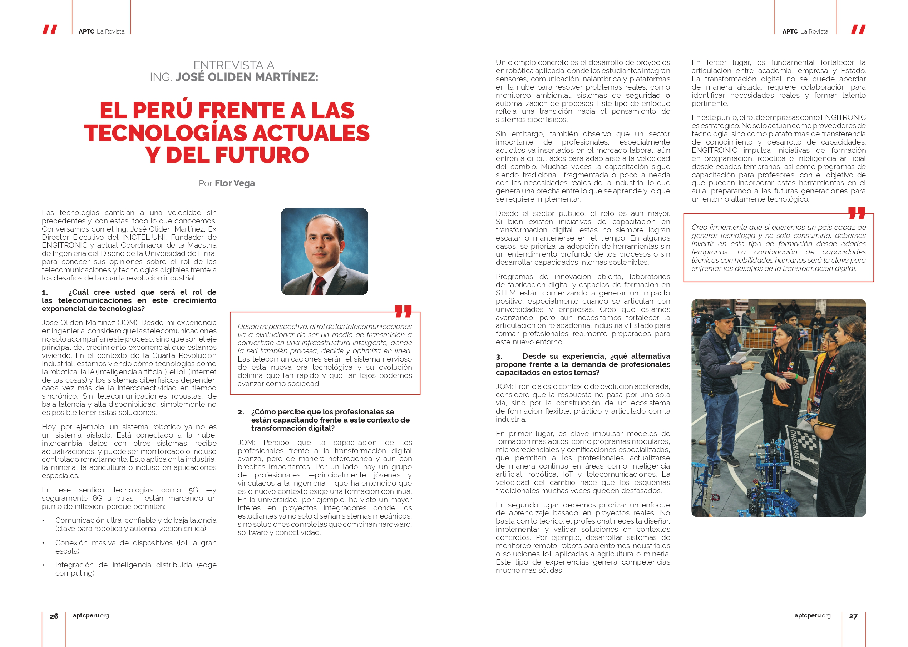
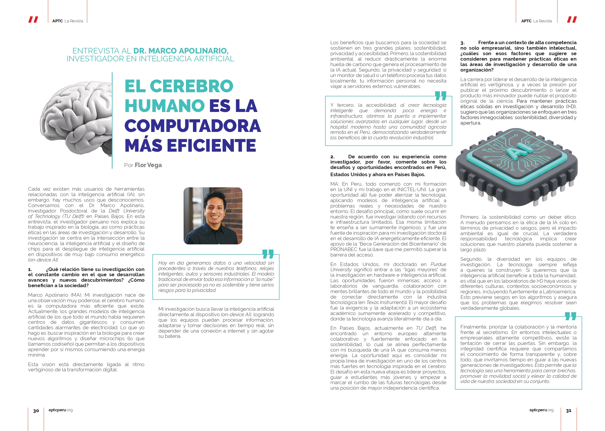

  For the APTC Magazine's most recent edition (April 26, Number 25), I generated the content and shaped its voice and style. I also implemented a science popularisation component.

  The Peruvian Telecommunications Association (APTC) publishes the magazine in both print (distributed across various regions and key industry events), and digital formats to ensure wider accessibility.

  A couple of interviews I want to highlight are the ones I conducted to:
  
  Jose Oliden Martinez, university professor, former INICTEL-UNI Executive Director (the National Research and Training in Telecommunications Institute), 
  
  and Dr. Marco Apolinario, post-doctoral researcher in NeuroAI at TU Delf (Netherlands) and a recipient of the Beca Generación del Bicentenario (PRONABEC) fellowship and the NSF AccelNet NeuroPAC Fellowship.

  The interview titles are translated as:

  “Peru: Perspectives on Current and Emerging Technologies” — Interview with José Oliden Martínez

  “The Human Brain Is the Most Efficient Computer” — Interview with Dr. Marco Apolinario

  You can access the magazine’s online version, April 2026 Number 25 Edition [here](https://aptcperu.org/aptc-la-revista/).
  
  If you are interested in an English translation or would like to connect with the interviewees, please feel free to reach out.

  <figure style="text-align: center;">
    
    <figcaption> “Peru: Perspectives on Current and Emerging Technologies” — Interview with José Oliden Martínez </figcaption>
  </figure>

  <figure style="text-align: center;">
    
    <figcaption> “The Human Brain Is the Most Efficient Computer” — Interview with Dr. Marco Apolinario  </figcaption>
  </figure>

