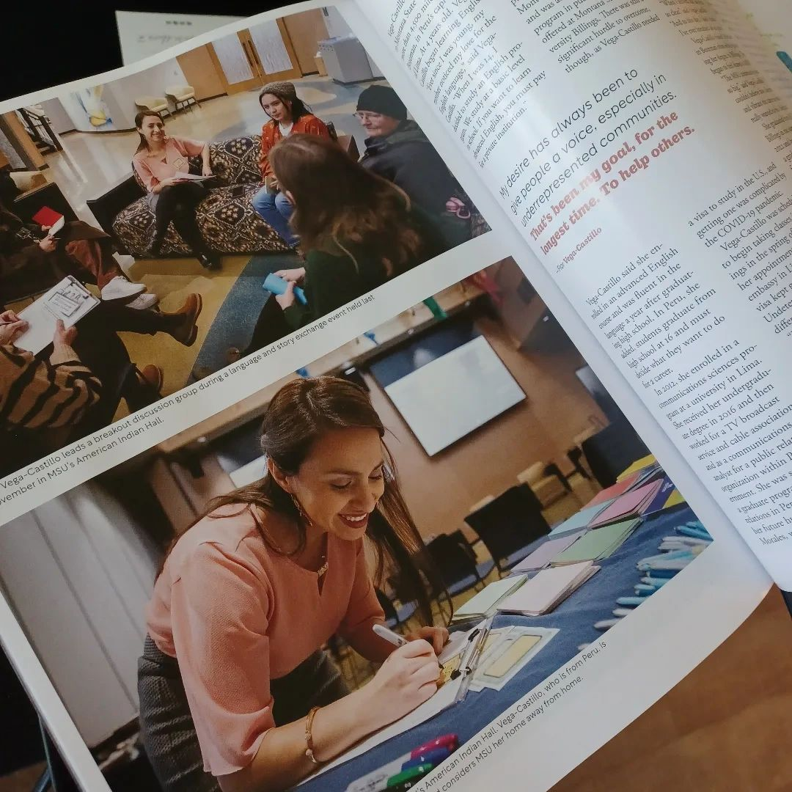
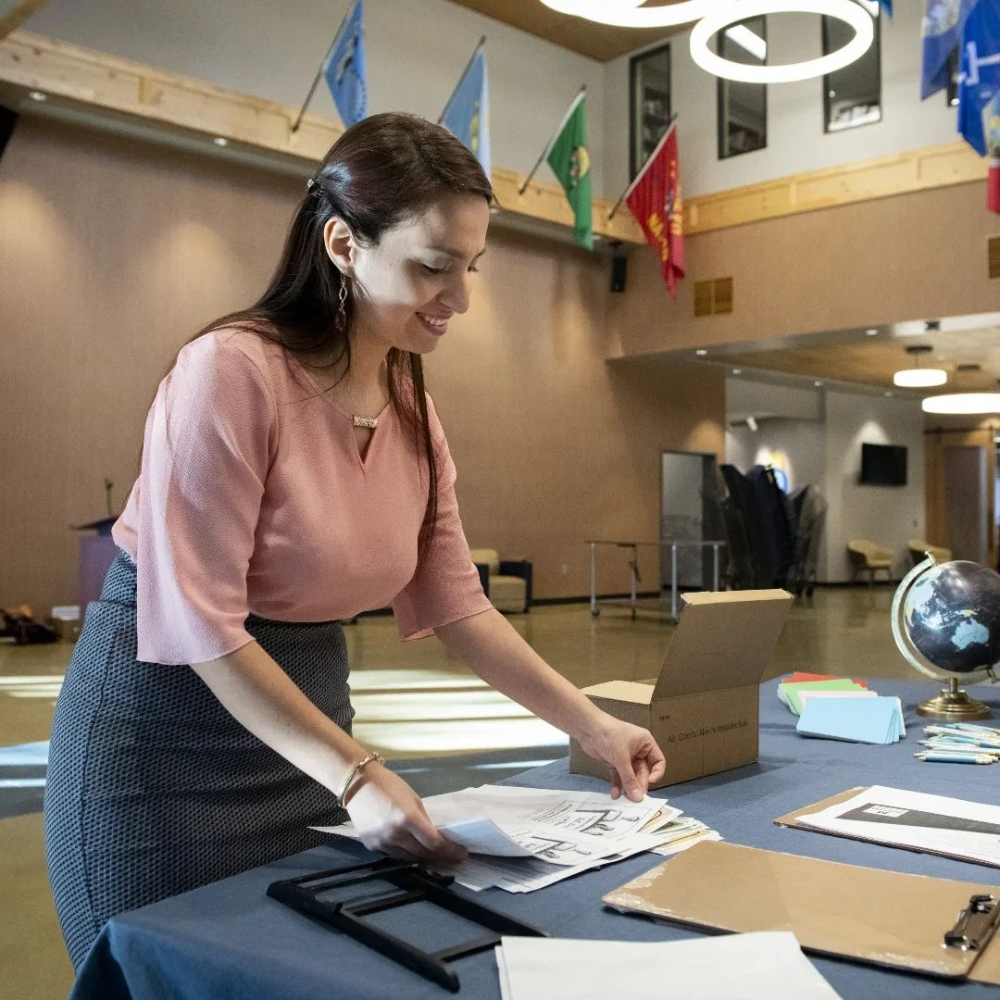

I got featured in Montana State University-Bozeman [Mountains & Minds magazine](https://www.montana.edu/news/mountainsandminds/23709/bringing-people-together) (Spring 2024 edition) 💙💛
When someone reached out to me and told me that the Dean of the Graduate School informed their team about me and my contributions on campus, I was perplexed. Mainly because I thought my engagement and volunteer performances were not being noticed. They didn't have to, in the first place. However, I was so wrong.

    

In this interview, conducted by Robert Bole, Writer/Editor at MSU News Services, I talk about my previous leadership roles as a student leader in two different organizations: [First-Generation Students Association at MSU](https://www.instagram.com/msu_firstgenerationstudents/) and [UNA-USA Montana State University Chapter](https://www.instagram.com/unausamontanastate/), and the work I assumed in those. I also mention some of the volunteer opportunities I engaged with at Thrive, WLI, [ProyectoSalud](https://www.instagram.com/proyecto_saludmt), and others. But most importantly, I share the story of how I started to get in love with the English language from a very young age (4 years old), the privilege I had to study it in a private institution (thank you, you know who you are), my career after graduating from college until I met who would change my life.

    
    <figcaption>Leading a breakout discussion group during a language and story exchange event held last November in MSU’s American Indian Hall.</figcaption>

    

