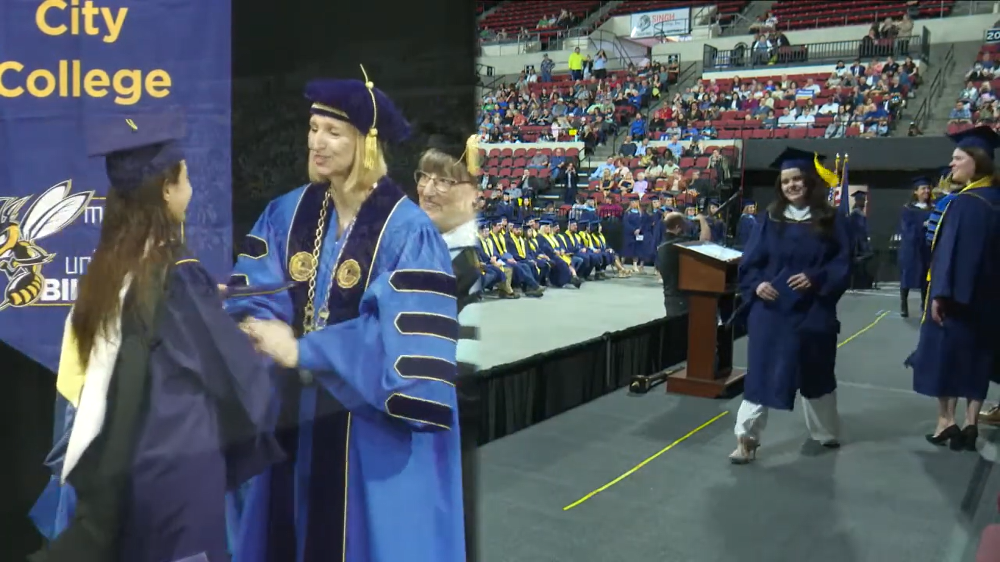

After joining in the Master of Science in Public Relation program in Spring 2021, being a full time student taking classes over the summer, I walked in the [Montana State University Billings](https://www.msubillings.edu/) Spring Commencement ceremony on May, 7.
I am thankful to have learned about a wide variety of topics such as organizational communications, issues in public relations, leadership, campaign planning, research methods and case studies.
I hold a Writing Graduate Assistant position at the [Academic Support Center](https://www.msubillings.edu/asc/), where I put into practice the acquired knowledge in content development and social media management. Making a "from the classroom to the real world" experience thanks to my supervisor and other colleagues who welcomed my ideas and encouraged me to explore my creativity levels.
My hard commitment to my studies also paid off after obtaining the MSUB Yellowstone Scholarship for three consecutive semesters (Spring 2021, Fall 2021, and Spring 2022). I was also involved with the MSUB Multicultural club, sharing experiences and connecting with other international students.

  <figure style="text-align: center;">
    
    <figcaption>The Peruvian flag waves outside the commencement venue, Metra Park in Billings.</figcaption>
  </figure>

My Peruvian flag 🇵🇪 came with me as a way to bring my family, my friends, and my country. I felt the need to take it because it reminds me why I am doing the things I do now. I am physically far from my people, but mentally with them and those who are for coming in the future.
A special thanks to my dear husband, who has always been my biggest supporter and the one who believed in me since day 1.

  <figure style="text-align: center;">
    
    <figcaption>The MSU Billings Chancellor, Dr. Stefani Hicswa, hands me my diploma at Metra Park.</figcaption>
  </figure>

  <figure style="text-align: center;">
    
    <figcaption>My loving husband, Ph.D. candidate Giorgio Morales, and I posing after the ceremony.</figcaption>
  </figure>

