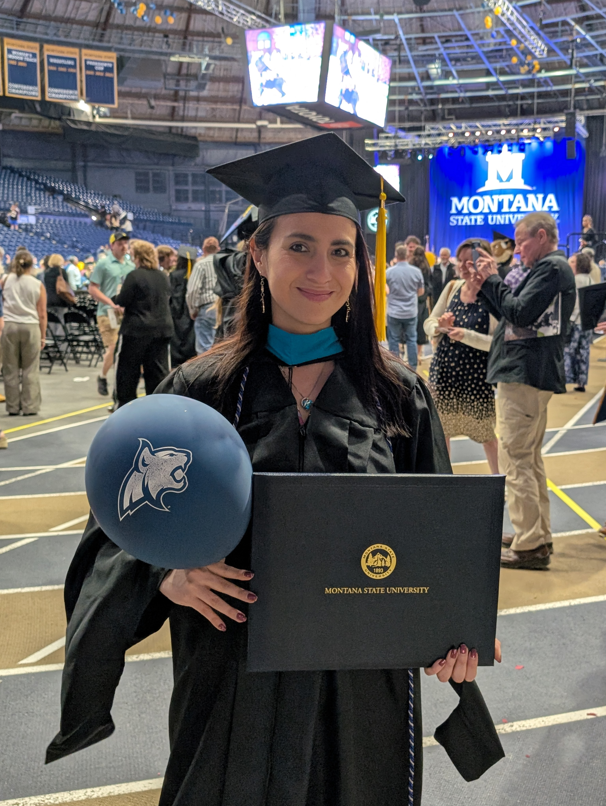

 I am thrilled to announce that I obtained a master in public administration degree from [Montana State University - MSU ](https://www.montana.edu/) with a 4.0 GPA. This is the second master's degree I succesfully complete in the United States. 

 I completed this chapter grateful for the opportunities I had, the recognitions, and the great relationships I built in Montana. The "406 state" will have a special place in our blue & gold hearts forever. 💙 💛 

 After graduating, I moved to Caen, France, where I am exploring job opportunities in France and England. If you are interested in learning more about my profile, please check out my CV attached in my homepage. 

  <figure style="text-align: center;">
    
    <figcaption>The peacock-colored hood I am wearing represents my public administration major and the cream-colored hood I carry in my hand is the one I got for my public relations degree. </figcaption>
  </figure>

  <figure style="text-align: center;">
    
    <figcaption>The bobcat is Montana State University's mascot and it's an icon on campus. </figcaption>
  </figure>

  <figure style="text-align: center;">
    
    <figcaption>Picture taken after the graduation ceremony on May 09, 2025. </figcaption>
  </figure>

