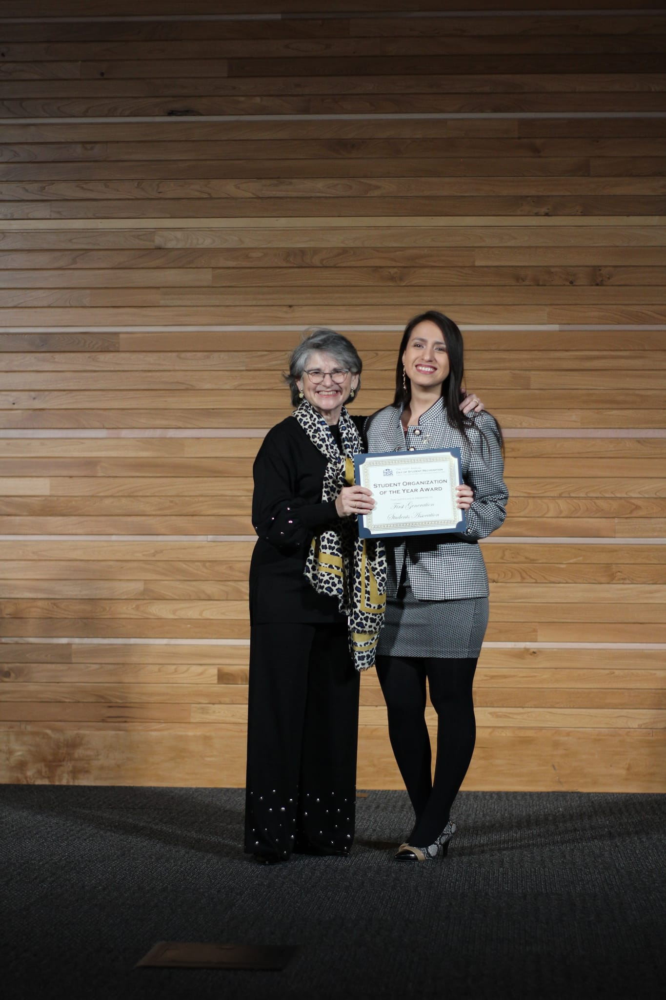
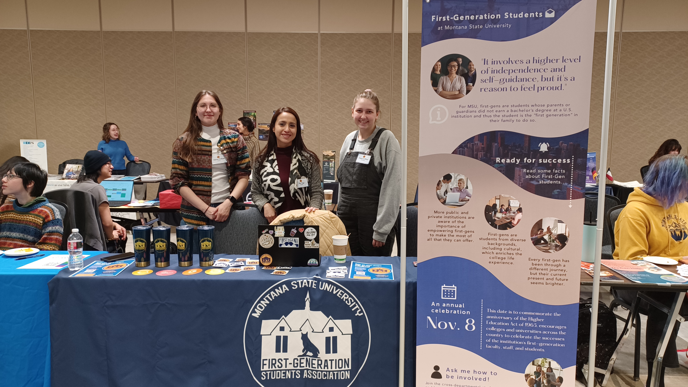
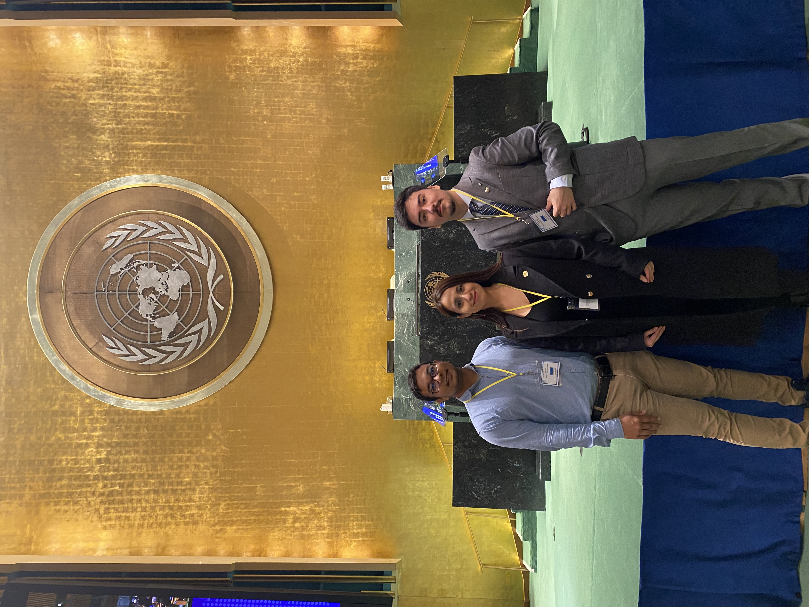

 Montana State University celebrated its 100th annual [Day of Student Recognition](https://www.montana.edu/engagement/programs/dsr/), where the university awarded students and groups in five categories: Legacy, Service, Leadership, Teaching & Mentorship, and Academics & Research. I'm thrilled to announce that I obtained the Spirit Outstanding Student Award - "Student who embodies leadership, citizenship, and involvement" (Service).

 Being a full-time graduate student, a graduate assistant in one of the core departments of MSU, like the Graduate School, president of the [First-Generation Students Association](https://www.instagram.com/msu_firstgenerationstudents/) and vice president of United Nations Association of the United States of America [UNA-USA Bozeman chapter](https://www.instagram.com/unausamontanastate/), a volunteer mentor for the [Thrive's](https://allthrive.org/) (non-profit organization) Child Advancement Project and a volunteer at the MSU Diversity and Inclusion Student Commons is helping me to discover my full potential. 

  <figure style="text-align: center;">
    
    <figcaption>Receiving the award from Montana State University President, Waded Cruzado.</figcaption>
  </figure>

Experiences in leadership positions at two student organizations taught me:
- Some students might go directly asking for some type of help, others might need you to reach out and invite them to join your group.
- There is always someone willing to help, from individuals as volunteers to Deans sponsoring our events and activities.
- Empowered students will feel more confident in achieving academic success.
- Student-led initiatives is as key for those organizing an event or program as for those faculty, staff or community members attending those. It is an invaluable development opportunity for students and attendees can learn many lessons from them.

  <figure style="text-align: center;">
    
    <figcaption>FGSA founding officers. From left to right: Audrina Williams (Secretary), Flor Vega-Castillo (President) and Natalie De Marco (Vice President) during the Study Abroad and Involvement Fair in Spring 2023. </figcaption>
  </figure>

  <figure style="text-align: center;">
    
    <figcaption>UNA-USA officers. From left to right: Siddat Nesar (Treasurer), Flor Vega-Castillo (Vice President) and Giovanni Guillen (Communications) during our visit to the United Nations Headquarters in New York. </figcaption>
  </figure>

