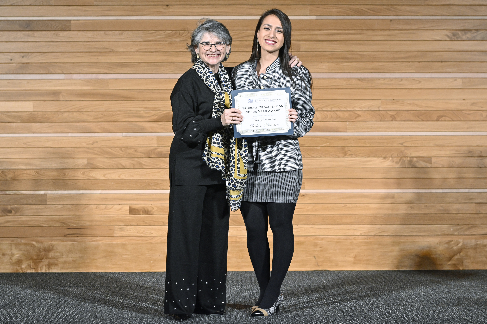

 Montana State University celebrated its 100th annual Day of Student Recognition, where the university awarded students and groups in five categories: Legacy, Service, Leadership, Teaching & Mentorship, and Academics & Research. I'm thrilled to announce that I obtained the Spirit Outstanding Student Award - "Student who embodies leadership, citizenship, and involvement" (Service).

 Being a full-time graduate student, a graduate assistant in one of the core departments of MSU, like the Graduate School, president of the [First-Generation Students Association](https://www.instagram.com/msu_firstgenerationstudents/) and vice president of United Nations Association of the United States of America (UNA-USA) Bozeman chapter, a volunteer mentor for the [Thrive's](https://allthrive.org/) (non-profit organization) Child Advancement Project and a volunteer at the MSU Diversity and Inclusion Student Commons is helping me to discover my full potential. 

  <figure style="text-align: center;">
    
    <figcaption>Receiving the award from Montana State University President, Waded Cruzado.</figcaption>
  </figure>

Thanks to the generosity of MSU offices, departments, and allies in the MSU community, we were able to host:
- Tabling events in student resource and student engagement fairs
- Professional development workshops with cross-departamental speakers
- Admissions webinars in partnership with the Admissions office
- The First-Gen week in partnership with MSU's offices
Among other initiatives.

  <figure style="text-align: center;">
    
    <figcaption>Dr. Barbara do Amaral, FGSA Club Advisor, and myself as FGSA representative after the ceremony.</figcaption>
  </figure>

