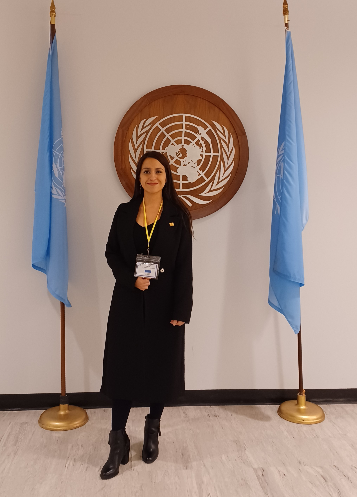
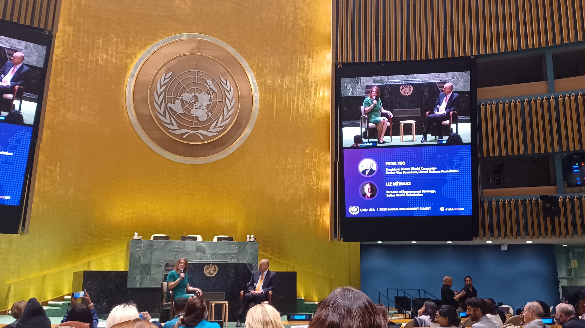
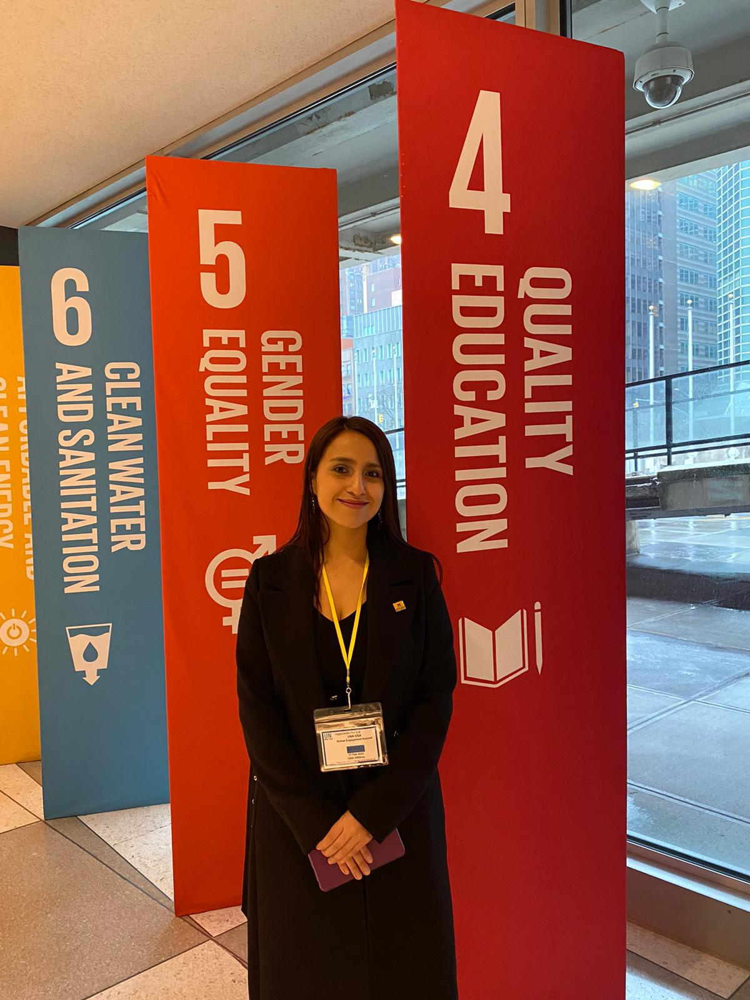
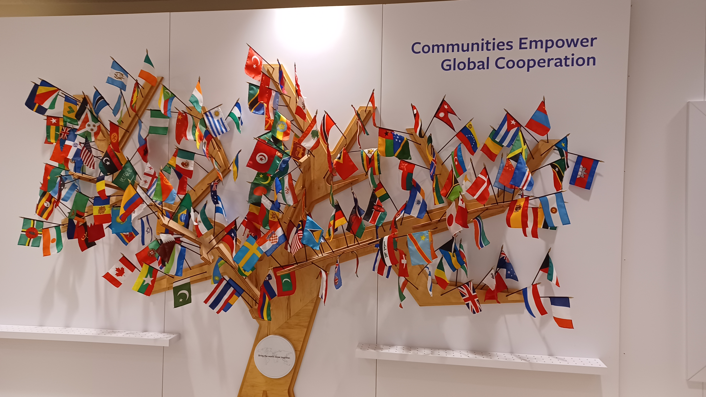

All of us are working towards a purpose bigger than what we think. I had the honor of attending the UNA-USA 2023 Global Engagement Summit, place where the "We the people" statement resonates more than ever. As Vice President of the United Nations Association of the United States of America [(UNA-USA) Bozeman chapter](https://www.instagram.com/unausamontanastate/), I proudly represented MSU at such an important event. Our chapter is the only chapter in the state of Montana.

The United Nations General Assembly Hall located in New York received us to address topics related to the Sustainable Development Goals, our road map, and what has been accomplished and needs to be done for the next generations. This [GES summit's](https://events.unfoundation.org/2023globalengagementsummit1) edition theme was "Empowered and Emboldened for Impact."
 

    

According to their official event page, the 2023 Global Engagement Summit united world leaders with the most selected changemakers. About a thousand community leaders gathered at the United Nations Headquarters in New York.

    

Encouraging young leaders to pursue change through positive impact, the UNA advocates for everybody's chance to have a seat at the table. What a pleasure to experience this once-in-a-lifetime opportunity! 

    

The Sustainable Development Goals (SDGs) I have a stronger commitment to are #4 Quality Education and #5 Gender Equality. Let's keep working towards a more collaborative global connections!

    

