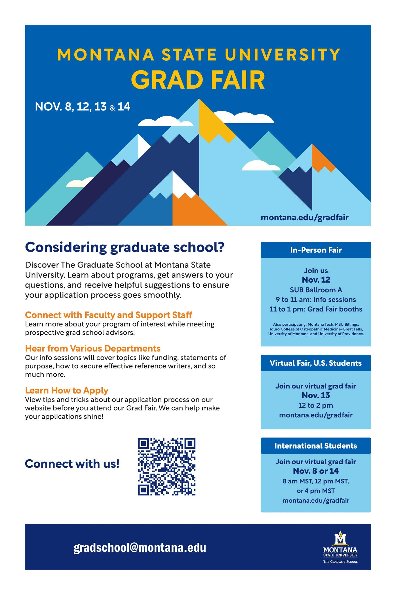
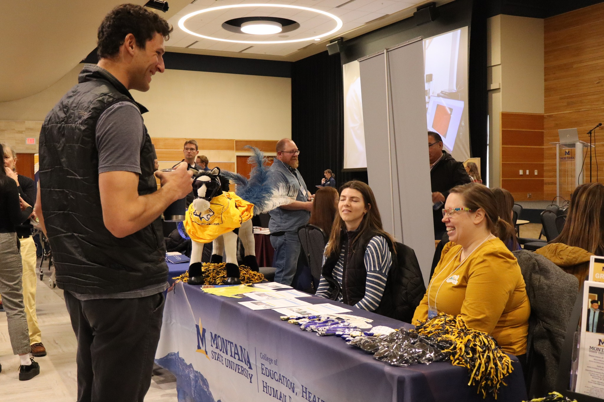
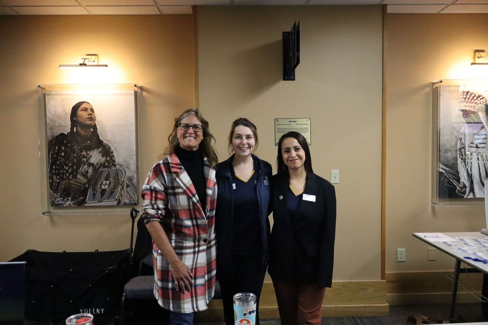
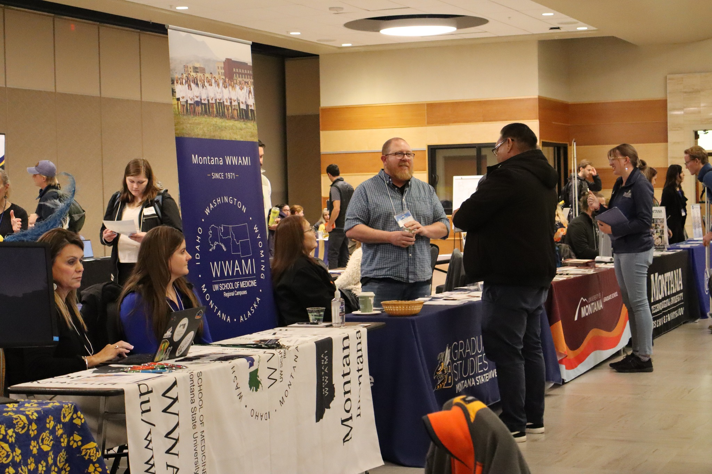

Although my team and I had hosted virtual Grad Fairs in the past, this time we also had an in-person component. In addition to two days of virtual sessions dedicated to international applicants (three per day) and one virtual session for U.S.-based applicants, we also hosted an in-person fair, with 24 MSU departments and five Montana university graduate schools participating (listed below). 

An average of 120 attendees joined the six international sessions 
Approximately 80 attendees participated in the U.S.-based virtual session.
Around 100 attendees came to the in-person Grad Fair.
I took a primary role in organizing, advertising, and hosting. Here are some of the tasks:

Logistics:
●Booked the venue, designed the setup, and coordinated catering orders.  
●Recruited and coordinated speakers and panelists for the in-person sessions.  
●Worked with the Office of International Programs to arrange hosts for the international virtual sessions.  
●Created a new design for the slides used during the info sessions and an auto-play presentation for the in-person fair, as well as the virtual sessions.  
●Developed welcome packets for booth representatives.   
●Created personalized name tags.  

Advertisement:
♦Worked with University Communications to assess and refine the design materials.
♦Executed social media posts and stories.
♦Distributed event graphics through MSU's digital outlets (screens in housing residences and dining halls, newsletters, event calendars, and announcements).
♦Coordinated a local radio Public Service Announcement (PSA).
♦Organized and attended tabling opportunities to increase event awareness.
♦Connected with student organizations to help promote the event.
♦Created content for the event website.
♦Drafted a press release for potential publication or news article creation.
♦Photo coverage on the day of the event.

Emailing:
▪️Wrote engaging emails and text messages to students in their second, third, and fourth years through the NavMSU platform.
▪️Revised automated emails to be sent to prospective students who registered for the sessions.
▪️Drafted invite emails for departments to forward to their prospective students.
▪️Communicated with speakers, panelists, and booth representatives, including session-specific details and reminders.

A huge thank you to my colleagues in the Recruitment and Admissions unit at The Graduate School at Montana State University: Melis Edwards, Danica Lower, Taylor Hophan-Nichols, Mackenzie Williams, and Nirvair Singh Khosa. 

Thanks for joining MSU Billings, Montana Technological University, University of Montana, University of Providence and Touro College of Osteopathic Medicine.

  <figure style="text-align: center;">
    
    <figcaption>Performers dance a traditional dance from Peru. From left to right: Me, Isabela Romero, Josset Guzmán, Adriana Reyes de Merkle, Jack, Evelyn Paz, and Paola Torres. </figcaption>
  </figure>

  <figure style="text-align: center;">
    
    <figcaption>Performers dance a traditional dance from Venezuela. From front to back: Aydemar Guerrero, Leonardo Valladares, Veronica Nelson, and Dionicio. </figcaption>
  </figure>

  <figure style="text-align: center;">
    
    <figcaption>Argentinian Empanadas, Venezuelan Arepas, Peruvian Chicken Causa, Colombian Bocadillo and more traditional food was served in this free event. </figcaption>
  </figure>

  <figure style="text-align: center;">
    
    <figcaption>Performers and attendees dance in the open dance floor after the program. A local DJ played the catchiest rythms from Argentina, Colombia, Peru and Venezuela and other Latin American countries like Mexico, Dominican Republic and others. </figcaption>
  </figure>

