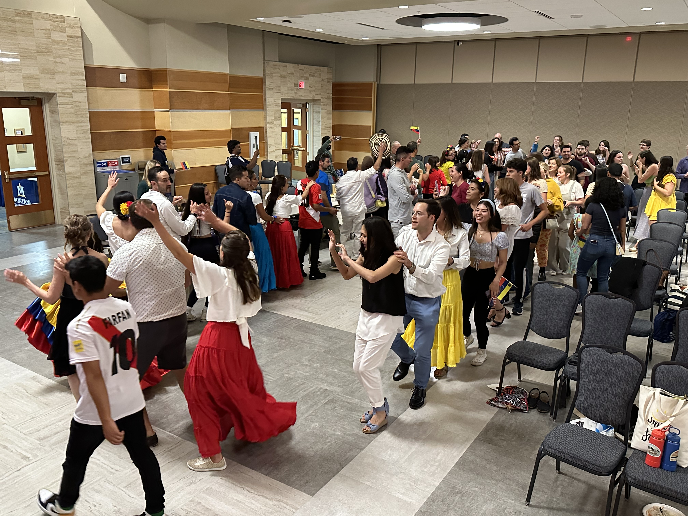

The First-Generation Students Association (FGSA), student organization I presided between November 2022 until December 22, hosted "Independence Fiesta" an event that celebrated the Independence Days of Argentina, Colombia, Peru and Venezuela. After inviting the Fuerza Latinx student organization to join us in our efforts, we hosted this very successful *Fiesta* 

Around 250 people from Bozeman, Belgrade and Big Sky and other nearby areas, came to campus to join in a common sense of togetherness. This was possible thanks to our diligent planning committee, our committed volunteers (who volunteered to dance, decorate, greet and other tasks), our generous donors (MSU departments and offices as well as community public organizations) and our attendees, the best audience we could have asked for. We had two to three traditional dances from each country, live music, a DJ, traditional games, and these nations' cuisine. 

As FGSA President and the chair planning committee, I also took on other responsibilities:
- Spearheaded the fundraising efforts, obtaining support from on-campus offices and non-profit organizations in Bozeman.
- Planned and led a complete multiplatform marketing campaign, including public service announcements on radio, social media reels and flyer design.
- Developed media management strategies, wrote press releases and served as one of the spokespeople for this event.
- Recruited dancers for the event and other types of volunteers.
- Ensured logistic needs were covered, including A/V tech and catering.
- Created and organized the slideshows shown at the event.
- Performed as one of the masters of ceremonies during the event. We conducted the event in both English and Spanish at all times to ensure a more accessible program.
- Choreographed the two Peruvian traditional dances we performed. 

We promoted the event through public service announcements, social media reels and posts, WhatsApp group messaging, email invites (general and personalized), [news articles](https://www.montana.edu/news/22999/montana-state-to-celebrate-inaugural-independence-fiesta-on-july-6), and got interviewed at a [local news broadcasting channel and website](https://www.kbzk.com/news/local-news/first-generation-south-american-students-bringing-independence-day-celebration-to-montana-state).

In general, we ended up with an incredible feeling of satisfaction. We had attendees from different nationalities, and perhaps more importantly, we had people from multiple countries performing with us celebrating our cultures.

    

    

    

    

