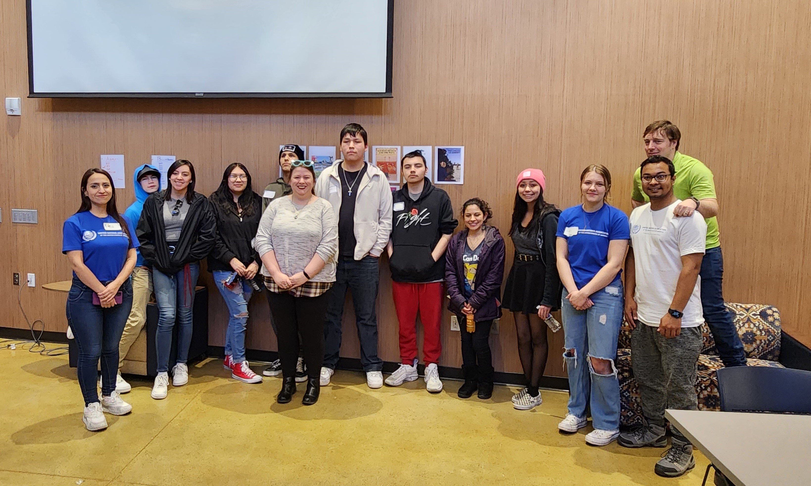
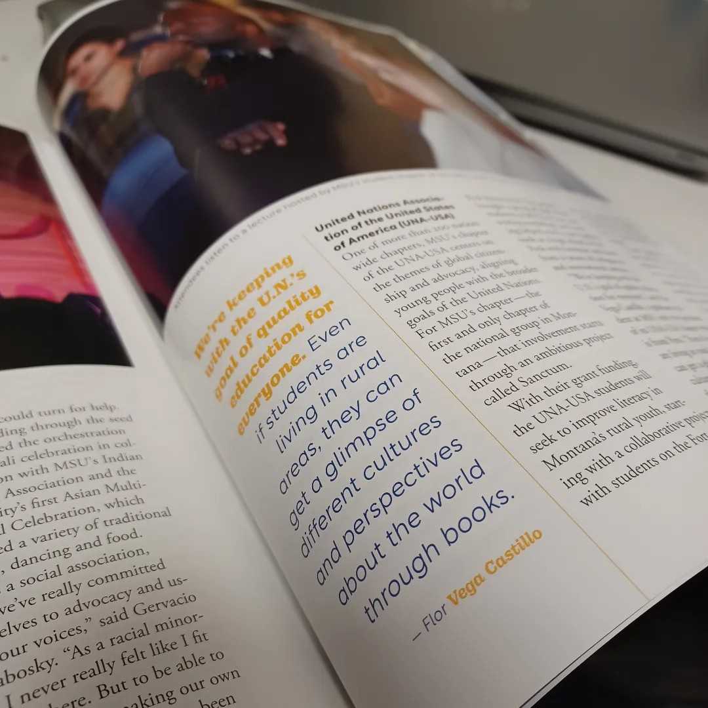

As an effort to promote the literacy rates in high school students from Native American Reservations and their multicultural exposure, the UNA-USA Montana State University-Bozeman Chapter got a seed-grant funding from the MSU Alumni Foundation. 

This was an incredible opportunities for the UNA-USA leadership team to work closely and collaboratively with the Office of International Programs and the Fort Peck Reservation high school's teachers and administrators. [The Mountains and Minds Magazine wrote about this](https://www.montana.edu/news/mountainsandminds/22882/embodying-diversity-equity-and-inclusion?fbclid=IwY2xjawJjdYVleHRuA2FlbQIxMAABHrw3jwdFg0BCZfIucR5z0QBQuc8b6sizpq9gZgIe0V8S_Joc-L3rJWI_s0R__aem_T8kojJF65ctfdBuE-GWJMg) and other four student-led efforts in its Spring 2023 edition.

A short quote from the article:

“With their grant funding, the UNA-USA students will seek to improve literacy in Montana’s rural youth, starting with a collaborative project with students on the Fort Peck Reservation. The project brought a group of high school students to MSU for tours and writing workshops, and funding helped stock a new reading nook at a high school in Fort Peck with furniture and books from a variety of Indigenous and international authors.”

  <figure style="text-align: center;">
    
    <figcaption>High school students, their teacher and the UNA-USA officers team after our first session.</figcaption>
  </figure>

This is another instance where I find myself truly enjoying the many other aspects of higher education and how public administration and public relations (both my majors) are connected in magnificent ways. I was responsible for:
- Developed media management strategies, wrote press releases and served as one of the spokespeople for this event.
- Arranged the panelists line-up for the first day of the event and moderated the panel discussion.
- Ensured logistic needs were covered, including A/V tech and catering.
- Ordered and acquired of the incentives for the panelists, and speakers through UNA-USA.
- Created and organized the slideshows shown at both days of the event while keeping consistent communication with the speakers and co-organizers.
- Shared my lived multicultural experiences in the second day of the event and engaged into deeper conversations during the reception.

  <figure style="text-align: center;">
    
    <figcaption>Part of the article at the MSU Mountains and Minds Magazine.
  </figcaption>
  </figure>

  <figure style="text-align: center;">
    
    <figcaption>Participants listening to UNA-USA members from Bangladesh, Mexico, Peru sharing their undergraduate and graduate experiences.</figcaption>
  </figure>

