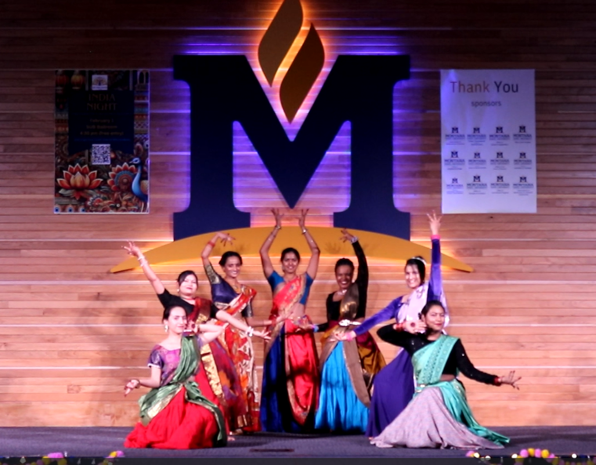
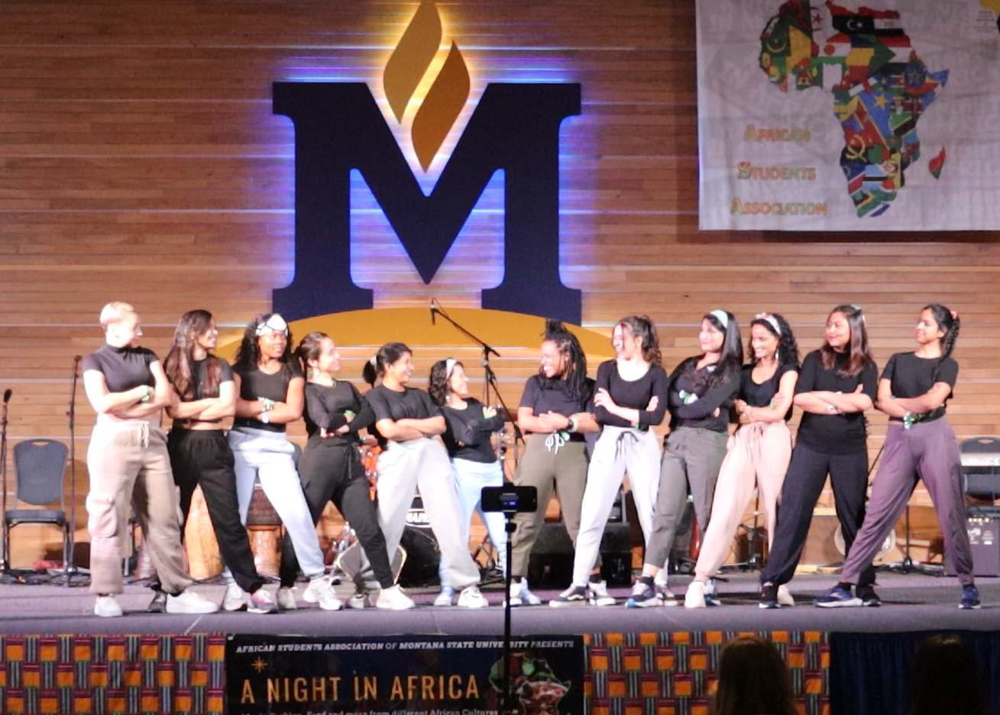

I grew up in Lima, Peru’s capital. Lima is characterized by its almost omnipresent gray sky. Lima “The Gray,” was built in a desert, but, surprisingly, it is not a one or two-color city. Lima is where people from all regions migrated searching for a brighter future. So, you see women wearing their colorful “polleras” (woven skirts made in their hometowns), men covered in songs that help them go through the day, or kids clothed in traditional costumes for dancing at school. Yes, Lima can be technicolor.  

My grandparents, the four of them, come from different Peruvian veins: from the northern part of Lima, from the highlands, from the south, and from a town near the rainforest area. I am a mixture of ethnicities within a small country, yet one of the most diverse republics. 

Coming to the United States only expanded my views on **the beauty that sometimes hides across our differences and the depth in the connections we choose to create.** At MSU, I have been fortunate to lead two student organizations that contributed to increasing the personal, academic, and professional opportunities for undergraduate and graduate students. 

At the First-Generation Students Association, most of the members were women in STEM majors and at the UNA-USA, most of the members were international students. Now, I am part of the leadership team at Footloose Fusion, a student organization created to come together and learn dances from our members’ countries. Our members volunteer to teach as a glimpse of a traditional dance they hold dear to as part of their identities and the rest take each step learned humbly and respectfully. We all dance thinking about how priceless it is to have a space to elevate our roots and share a piece of home with the rest of the world. 

My commitment is to always welcome and celebrate diversity and foster inclusion and equity. As I read somewhere else, **diversity is a fact, inclusion is an act, and equity the goal.**

    

    

    

    

