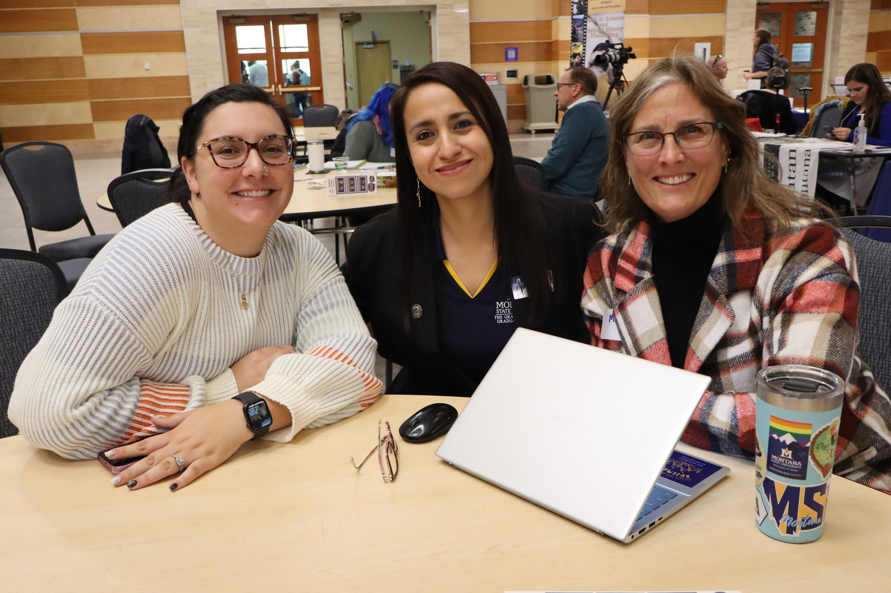
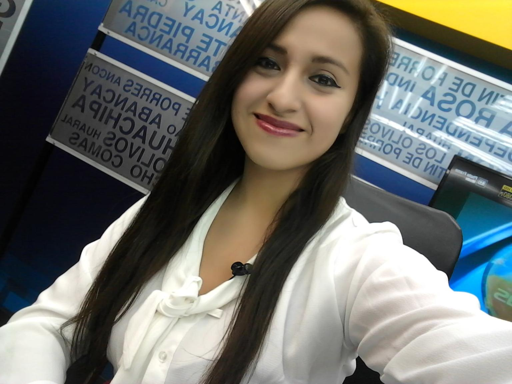
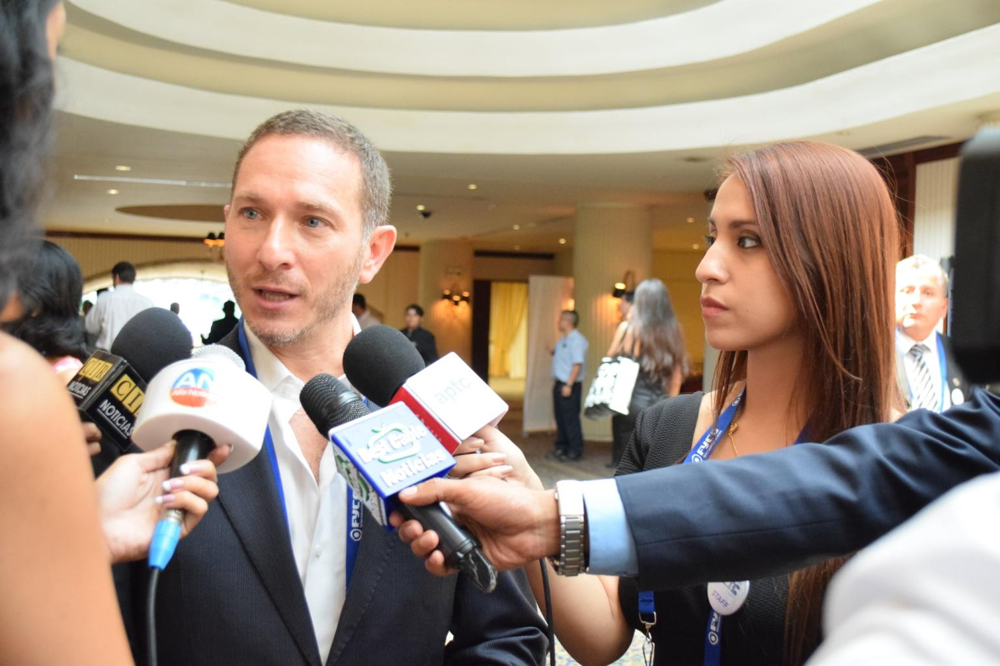

When I look back and see myself as a 13-year-old teenager searching for 10-cent coins on the sidewalks on my way back home from school, I reflect on **the role education and timely access to information have played in my life.** Now, I am a driven communications professional with almost 10 years of experience in the public and private sectors in Peru and the United States. 

I combined a mix of an unconditional commitment to my undergraduate studies to obtain scholarships, and additional coursework as continuing education to get better job opportunities. Learning a second language and going through English proficiency tests. Overall ongoing hard work, long shifts at initial jobs, and other investments towards my future knowing that things would eventually get better. As a result, I have relevant experience working in recognized organizations, including a public institution in telecommunications research, higher education recruitment and admissions as well as an academic support center, and other for-profit organizations. 

Due to my time management skills acquired at a young age, I developed a strong capacity to manage different assigned duties and projects and deliver effective results satisfying set deadlines - all while continuously training myself with additional courses when I was in Peru and being involved in leadership positions during my two master’s degree studies in the United States. They also shaped **my awareness of different groups’ needs to serve them better and uplift their capacity to achieve their best self.** 

At each of my current and past workplaces, I have strived to build and maintain solid professional relationships based on mutual respect, collaboration, and mentorship. I believe in everyone’s potential to offer valuable insights, especially those in the early stages of their career. After learning how priceless quality education and access to information can be, I have always met my team’s expectations while having a great attitude. I’ll be happy to tell you more about it on a phone call or video call. 

  <figure style="text-align: center;">
    
    <figcaption>In-person and Virtual Grad Fair team, November 2024. From left to right: Danica Lower, Flor Vega Castillo, Melis Edwards.
  </figcaption>
  </figure>
 

  <figure style="text-align: center;">
    
    <figcaption>In my role as a news anchor and reporter in Lima, Peru, 2016.
  </figcaption>
  </figure>
 

  <figure style="text-align: center;">
    
    <figcaption>During my role as a workshop instructor at the International TV broadcasting for emergency systems course hosted by INICTEL-UNI. Lima, Peru, 2019.
  </figcaption>
  </figure>
 

