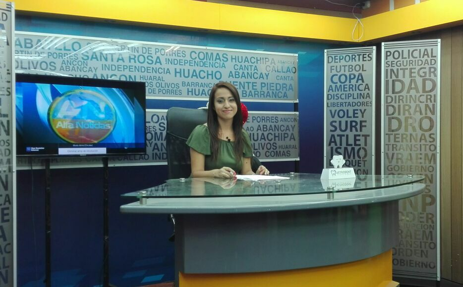
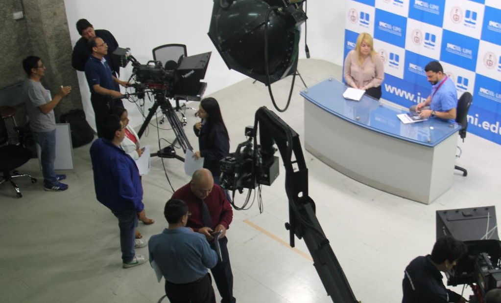

At age 16, right before graduating from high school, I found out what my life mission would be. Before making that life-changing decision, I weighed the possibilities through three different potential careers: sociologist, lawyer, or journalist. Until I finally decided that it could be a mix of different things to approach **my true vocation: helping people to amplify their voices.** “Communications Sciences it is.” 

My calling for serving the public started in my early career as a TV reporter, where I would visit the most underserved communities to echo their voices, making sure they’d get the local government and private donors’ attention. I would cover those cases where constituents, individuals, or organized groups asked for help. Then, after joining the Public Relations and Affairs Office at the Telecommunications Research National Institute, I would disseminate those research projects’ results to the final users and the overall community. My job was to summarize and interpret the scientific language to a clearer product available for all education-level citizens. 

Then, I have kept in mind that **it’s not just a matter of being resilient in order to help people, but to help people to be resilient themselves.** That’s my commitment to the public sector, whether it’s at the university level or a public service in general because “no one came into this world to be alone” - Eiichiro Oda. 
 

  <figure style="text-align: center;">
    
    <figcaption>In my role as a news anchor and reporter in Lima, Peru, 2016.
  </figcaption>
  </figure>
 

  <figure style="text-align: center;">
    
    <figcaption>During my role as a workshop instructor at the International TV broadcasting for emergency systems course hosted by INICTEL-UNI. Lima, Peru, 2019.
  </figcaption>
  </figure>
 

  <figure style="text-align: center;">
    
    <figcaption>Celebrating with other performers and attendees at the Asian Multicultural Night on April 2024.
  </figcaption>
  </figure>
 </div